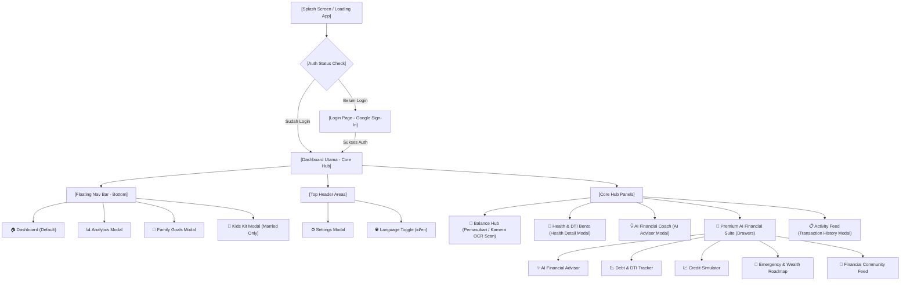
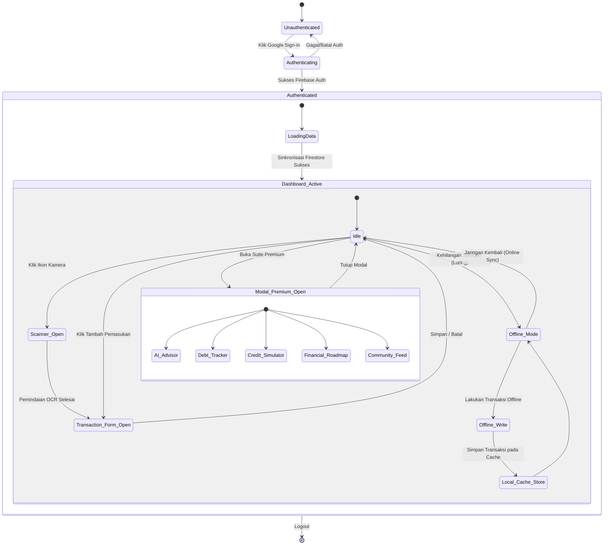

# Nemu: Information Architecture (IA) Specification - Optimized
### "Structural Navigation & Content Map for Financial Harmony"

Dokumen ini mendokumentasikan spesifikasi **Information Architecture (IA)** dari aplikasi **Nemu**. Dokumen ini menjabarkan pemetaan konten, hierarki navigasi, alur interaksi pengguna, dan hubungan data dalam sistem untuk memastikan akses informasi yang intuitif dan logis.

---

## 1. STRUKTUR NAVIGASI TINGKAT TINGGI (HIGH-LEVEL NAVIGATION MAP)

Nemu dirancang menggunakan arsitektur **Single-Page Application (SPA)** yang berpusat pada sebuah **Dashboard Utama (Core Hub)**. Semua fitur premium dan fungsionalitas pendukung diakses melalui **Laci Geser Bawah (Bottom-Drawer Modals)** untuk menjaga agar navigasi tetap datar, cepat, dan ramah seluler tanpa perlu memuat ulang halaman secara mendalam (*deep page reloads*).



---

## 2. RANCANGAN POHON NAVIGASI DETAIL (NAVIGATION TREE & CONTENT NODES)

Berikut adalah struktur konten detail dari setiap simpul (*node*) navigasi dan modal di aplikasi Nemu:

### Level 1: Layang Pembuka & Gerbang Masuk (Auth & Welcome)
*   **Splash Screen**: Inisialisasi sinkronisasi database Firestore, logo N logo berputar, slogan.
*   **Login Page**:
    *   *Header*: Pilihan bahasa, inisial N berdenyut.
    *   *Bento Benefit*: Informasi fitur (AI-Powered Smart Scanning & Collaborative Shared Wallets).
    *   *Tindakan*: Tombol masuk akun Google ("Sign in with Google").

### Level 2: Dashboard Utama (The Central Dashboard Core)
*   **Header Navigasi Atas**:
    *   *Branding*: Logo Nemu & Tag Status "Premium".
    *   *Interaksi*: Tombol ganti bahasa (ID/EN) & Foto profil pengguna (membuka *Settings Modal*).
*   **Balance Hub (Pusat Saldo)**:
    *   *Informasi*: Indikator nama kustom ruang (fallback ke nama default bawaan lokalisasi), Total saldo terformat dalam mata uang aktif (IDR, USD, SGD) (disamarkan jika privasi aktif), Tren persentase bulanan, Lencana status "Overbudget" (jika alokasi pagu anggaran kategori melampaui saldo berjalan).
    *   *Tindakan*: Tombol manual "Pemasukan" (membuka *Transaction Form*), Tombol ikon kamera "Scan Struk" (membuka *Camera Scanner*), & Tombol mata "Sembunyikan Saldo" (Eye/EyeOff) untuk menyamarkan nominal berjalan dengan masker pelindung (`••••••`) demi privasi di ruang publik (aktif secara default).
*   **Bento Kartu Anggaran Bulanan (Monthly Budgets Bento)**:
    *   *Visual*: Bar kemajuan Framer Motion yang berubah warna secara dinamis (Hijau < 70%, Oranye 70-90%, Merah > 90%).
    *   *Informasi*: Penggunaan Month-to-Date (MTD) dari transaksi aktif berjalan berbanding batas pagu kategori (Makanan, Transportasi, Belanja, Tabungan).
    *   *Tindakan*: Tombol "Atur Batas" untuk membuka panel konfigurasi ruang (*Settings Modal*).
*   **Kesehatan & Batas Aman Bento (Financial Health Gauges)**:
    *   *Card 1*: Skor Kesehatan Finansial (skala 100), Status kesehatan, Indikator persen berputar.
    *   *Card 2*: Rasio Debt-to-Income (DTI), Status batas aman, Indikator persen berputar.
    *   *Aksi*: Klik kartu membuka *Health Detail Modal*.
*   **Pelatih Keuangan AI (Financial Coach Insight)**:
    *   *Visual*: Kartu asisten berwarna oranye dengan ikon Sparkles berdenyut.
    *   *Konten*: Rekomendasi/saran keuangan satu kalimat dari AI Coach terintegrasi dengan deteksi batas anggaran kategori (menyajikan peringatan khusus jika batas anggaran terlampaui/mendekati batas).
    *   *Aksi*: Tombol "Analyze" untuk memicu regenerasi saran.
*   **Bento Grid Quick Stats (Statistik Ringkas)**:
    *   *Card Kiri*: Total Pemasukan bulan berjalan.
    *   *Card Kanan*: Total Pengeluaran bulan berjalan.
    *   *Aksi*: Klik kartu membuka *Transaction History Modal* dengan filter otomatis.
*   **Premium AI Financial Suite Grid (Grid Panel Premium)**:
    *   *Item 1*: **Asisten Finansial AI** (Membuka *AI Advisor Modal*).
    *   *Item 2*: **Pelacak Utang & DTI** (Membuka *Debt Tracker*).
    *   *Item 3*: **Simulator Kredit** (Membuka *Credit Simulator*).
    *   *Item 4*: **Peta Jalan Finansial** (Membuka *Roadmap*).
    *   *Item 5*: **Feed Komunitas Sosial** (Membuka *Community Modal*).
*   **Aktivitas Terbaru (Activity Feed)**:
    *   *List*: 5 Transaksi terakhir (kategori, deskripsi, tanggal, nominal berwarna sesuai jenis transaksi).
    *   *Aksi*: Tombol "View All" (membuka *Transaction History Modal* secara penuh).
*   **Modul Keuangan Anak (Kids Kit - Khusus Married Space)**:
    *   *Visual*: Latar belakang hijau emerald lembut dengan ikon bayi berukuran besar.
    *   *List Tabungan*: Target tabungan anak & bar kemajuan target tabungan.
    *   *List Tugas*: Tugas harian anak, nominal imbalan, tombol klaim hadiah.

---

## 3. STATE MACHINE ALUR PENGGUNA (USER FLOW STATE MACHINE) - OPTIMIZED

Sebagai optimasi sistem analis, berikut adalah pemetaan mesin status (*state machine*) alur navigasi dari awal aplikasi hingga interaksi modal:



---

## 4. PERSYARATAN SEO & RUTING METADATA PWA (SEO & PWA METADATA ROUTING) - OPTIMIZED

Untuk mengoptimalkan struktur PWA dan visibilitas mesin pencari (SEO), arsitektur informasi Nemu mengatur perutean meta dan struktur judul sebagai berikut:

### 4.1 Hierarki Judul Semantis (Semantic Heading Structure)
*   Setiap halaman atau tampilan modal harus memiliki satu judul utama `<h1>` yang unik dan deskriptif untuk keterbacaan yang ramah SEO dan pembaca layar.
*   Hierarki sub-judul wajib mengikuti urutan logis (`<h1>` $\to$ `<h2>` $\to$ `<h3>`) tanpa ada lompatan level heading demi kepatuhan a11y.

### 4.2 Kriteria Manifest & Metadata PWA
*   **Web App Manifest (`app.json` / `manifest.json`)**: Wajib menyediakan ikon berukuran $192 \times 192\text{ px}$ dan $512 \times 512\text{ px}$ dengan warna tema (`theme_color`) `#1c1917` (Charcoal) dan warna latar belakang (`background_color`) `#fdfcfb` (Warm Sand).
*   **Semantic Router IDs**: Semua tombol interaktif dan elemen navigasi wajib memiliki ID unik deskriptif (contoh: `btn-scan-receipt`, `btn-open-ai-advisor`) untuk mendukung pengujian otomatis lintas-browser (*cross-browser automated testing*).

---

## 5. SISTEM PELABELAN & INTERNASIONALISASI (TAXONOMY & LABELING SYSTEM)

Nemu menggunakan sistem pelabelan dwibahasa (Bilingual) terpadu di bawah pengelolaan `i18next`. Semua pengenal (*IDs*), tombol, dan masukan nama kategori harus konsisten di seluruh aplikasi:

### 5.1 Taksonomi Kategori Transaksi
Aplikasi mengklasifikasikan transaksi keuangan ke dalam taksonomi kategori berikut:
*   `Food` 🍱 (Makanan & Minuman)
*   `Transport` ⛽ (Bahan Bakar & Transportasi Umum)
*   `Shopping` 📦 (Belanja Barang Fisik / Gaya Hidup)
*   `Savings` 💰 (Tabungan, Dana Darurat, & Investasi)
*   `Obligation` 💳 (Repayment/Cicilan Utang)

### 5.2 Pelabelan Konsisten (ID vs EN)

| Kunci Terjemahan | Label Bahasa Indonesia (ID) | Label Bahasa Inggris (EN) | Modul Terkait |
| :--- | :--- | :--- | :--- |
| `app_name` | Nemu | Nemu | Global |
| `slogan` | Harmoni keuangan keluarga, didukung oleh AI. | Financial harmony for your family, powered by AI. | Login & Splash |
| `shared_balance`| Saldo Gabungan Keluarga | Shared Family Balance | Dashboard |
| `debt_tracker` | Pelacak Utang & DTI | Debt & DTI Tracker | Premium Suite |
| `credit_simulator`| Simulator Kredit | Credit Simulator | Premium Suite |
| `roadmap_title` | Peta Jalan Darurat & Kekayaan | Emergency & Wealth Roadmap | Premium Suite |
| `kids_kit` | Modul Keuangan Anak | Kids Financial Kit | Dashboard / Kids |

## 6. SKEMA HUBUNGAN DATA & ISOLASI DATABASE (DATA RELATIONSHIPS & SPACE ISOLATION)

Model arsitektur informasi Nemu mengatur hubungan data dengan pemisahan database modular yang terisolasi secara penuh (*strict database isolation*):

```
                     +----------------------------+
                     |    [User Profile Document] |
                     +----------------------------+
                       /          |             \
                      /           |              \
      (personalSpaceId)     (coupleSpaceId)     (familySpaceId)
                    /             |               \
                   v              v                v
      +-----------------+  +-----------------+  +-----------------+
      | Personal Space  |  |   Couple Space  |  |   Family Space  |
      |   (families)    |  |   (families)    |  |   (families)    |
      +-----------------+  +-----------------+  +-----------------+
        |                    |                    |
        |==> Transactions    |==> Transactions    |==> Transactions
        |==> Debts           |==> Debts           |==> Debts
                             |==> Saving Goals    |==> Saving Goals
                                                  |==> Tasks
                                                  |==> KidWallets
```

*   **Pemisahan Tiga Basis Data (Triple isolated space per user)**: Setiap akun pengguna memiliki hubungan ke tiga dokumen ruang (`families`) terpisah secara paralel:
    *   `personalSpaceId` (ID: `personal_${userId}`): Menyimpan data anggaran pribadi yang sepenuhnya privat.
    *   `coupleSpaceId` (ID: `couple_${userId}`): Menyimpan data bersama dengan pasangan. Dapat digabungkan dengan pasangan lain menggunakan kode undangan (`inviteCode` bertipe `C-*`).
    *   `familySpaceId` (ID: `family_${userId}`): Menyimpan data keuangan keluarga besar termasuk modul tabungan anak. Dapat digabungkan menggunakan kode undangan keluarga (`inviteCode` bertipe `F-*`).
*   **Mekanisme Perpindahan Dinamis (Dynamic Context Switching)**: Ketika pengguna mengubah tipe ruang di pengaturan, sistem memperbarui properti `familyId` (aktif) pada dokumen profil pengguna (`users`), kemudian melakukan pemuatan ulang halaman (*reload*). Semua real-time listener Firestore secara dinamis akan me-resubscribe data transaksi, tugas, dan saldo khusus milik ID ruang baru tersebut, menjaga independensi data 100%.
*   **Transaksi Terisolasi**: Dokumen transaksi, tugas, dan target tabungan selalu menyertakan atribut `familyId` yang sesuai dengan ruang aktif, mencegah kebocoran data antar-catatan keuangan.
*   **Pelacakan Utang Real-Time & Terisolasi**: Kewajiban utang aktif berjalan dilacak dan disinkronkan secara real-time melalui koleksi Firestore `debts` berbasis query filter `familyId`. Hal ini memungkinkan kolaborasi pelacakan dan cicilan utang antar-pasangan/keluarga di Couple/Family Space, sekaligus menjaga kerahasiaan penuh di Personal Space (di mana `familyId` yang aktif merupakan sandbox privat pengguna).
*   **Kustomisasi Fleksibel Ruang & Anggaran**: Pengaturan per ruang (`families`) bersifat independen. Pengguna dapat mengubah nama kustom (`name`), mata uang aktif (`currency` IDR/USD/SGD), serta peta batasan anggaran (`budgetLimits`) per ruang aktif. Database listener otomatis mendeteksi perubahan ini dan merender data terformat serta kemajuan anggaran secara responsif.

